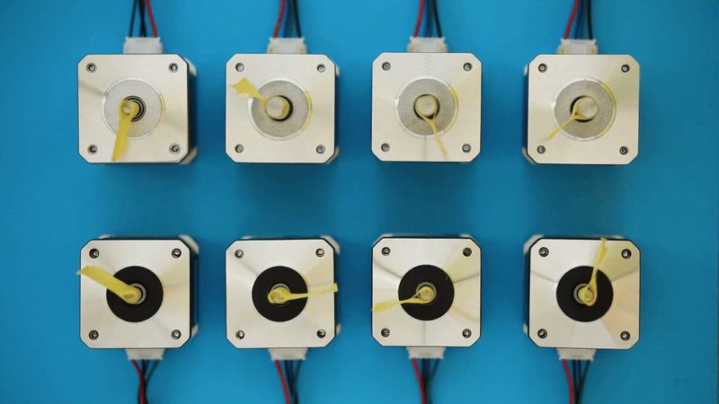
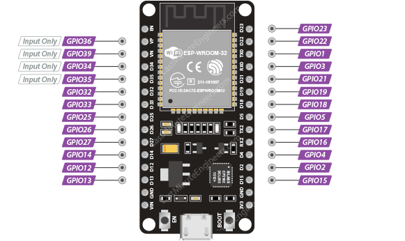
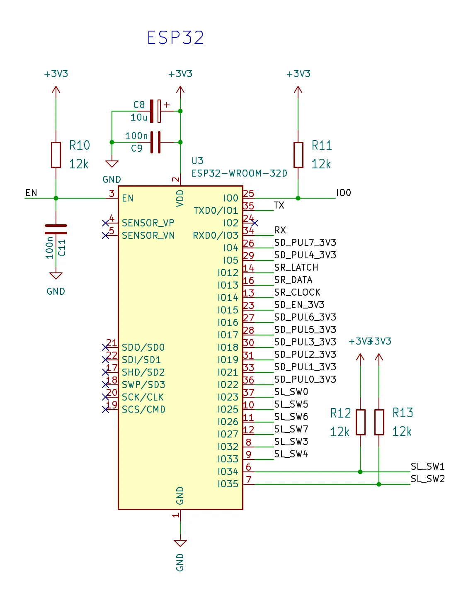
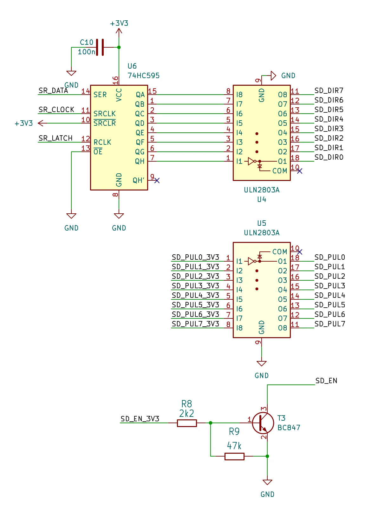

## Introduction

Recently, I got a task to control eight sliders, each driven by a NEMA17 stepper motor, as part of a larger machine. For this, I received an **Arduino Mega** and **DM542** stepper drivers. To keep things simple, the following constraints were set:
- Use **Arduino** framework for development.
- Use the **AccelStepper** library to control the stepper motors.

Using AccelStepper is straightforward: just setup I/O pins, set the speed and acceleration and voila that's it. Then, use `stepper.moveTo()`
 to turn the stepper motor in the desired direction.

After a quick test sketch, I realized that the Arduino Mega was too slow for the required performance. It can drive 8 steppers, but with limited speed. The root cause lies in the slow `digitalWrite()` function and in the clock speed of 16Mhz.

While direct port manipulation could speed up GPIO operations, the main loop must still process incoming UART messages and other logic. As a result, it remains uncertain whether these optimizations would meet the required performance targets. Rather than gambling on micro-optimizations, I opted to replace the Mega with a more powerful **ESP32**. In any case, the selected solution will require either an adapter board or a custom PCB to integrate all components.

The ESP32 runs at 80-240 MHz, offering a significant performance boost. However, it comes with its own challenges: the ESP-WROOM-32 module exposes only 25 GPIO pins (compared to Mega's 54) and some of them are limited or have special functions during boot.



The total number of GPIO pins required for this setup is **34**, based on:
- 2 GPIO pins for UART
- 8 GPIO pins for limit switches
- 24 GPIO pins for DM542 stepper drivers (8 × ENA, 8 × PUL, 8 × DIR)

Since the ESP32 offers only 25 usable GPIOs, the total count of required GPIOs needs to be reduced by at least nine.

Let's consider the first 2 bullet points cannot be optimized and focus on the third one.

The ENA pin on the DM542 is used to enable/disable the driver's outputs. If left unconnected, the driver remains enabled by default. Instead of removing ENA pins completely, all ENA pins are tied to a single GPIO pin allowing all drivers to be controlled at once. This change reduces the total pin count from 34 to **27**.

The PUL (pulse) pin defines the step rate and must be precise for smooth motor movement. These pins remain directly connected to the ESP32.

That leaves the DIR (direction) signals as the last thing to fiddle with. Unlike pulses, direction changes have lower frequency (direction is set once before sending pulses) making them perfect for optimization. By routing all DIR signals through a shift register (74HC595), which provides 8 parallel outputs from just 3 control lines, the number of GPIO pins drops to **22** in total.

 Necessary steps for GPIO reduction plan are desribed below.

## Hardware

The main modification on the ESP32 side is related to handling inputs. The rest simply involves connecting UART, the shift register and PUL pins to GPIOs.

Since IO34 and IO35 are input-only pins, without internal pull-ups or pull-downs, I added external pull-up resistors to make their behavior consistent with the other input pins.

The following image represents the connection diagram for the ESP32:



The schematic displayed on the image below shows the shift register and level shifters (inputs left, outputs right). Since the ESP32 operates at 3.3 V and the DM542 expects control signals in the 5-24 V range, level shifting is required for the ENA, DIR and PUL signals. While some DM542 variants can tolerate 3.3 V logic, to be on the safe side, I chose to connect ULN2803A to DIR and PUL signals and to drive ENA with a single transistor.



**Note:** The DM542 stepper driver is wired in a common-anode configuration.

## Firmware

On the firmware side, it is needed to connect the shift register to AccelStepper's output handling logic. In other words, adapt AccelStepper to use a shift register for controlling the direction (DIR) signal.

First, let's create the `ShiftRegister` driver class:

```c++
class ShiftRegister {
  public:
    ShiftRegister(uint8_t latchPin, uint8_t clockPin, uint8_t dataPin)
        : mLatchPin(latchPin), mClockPin(clockPin), mDataPin(dataPin),
          mData(0) {}

    void initialize() {
        pinMode(mLatchPin, OUTPUT);
        pinMode(mClockPin, OUTPUT);
        pinMode(mDataPin, OUTPUT);
        shiftOutData(0x00);
    }

    uint8_t getData() const { return mData; }

    void shiftOutData(uint8_t data) {
        mData = data;
        digitalWrite(mLatchPin, LOW);
        shiftOut(mDataPin, mClockPin, MSBFIRST, data);
        digitalWrite(mLatchPin, HIGH);
    }

  private:
    uint8_t mLatchPin;
    uint8_t mClockPin;
    uint8_t mDataPin;
    uint8_t mData;
};
```
More details about how shift registers  work: [Serial to Parallel Shifting-Out with a 74HC595](https://docs.arduino.cc/tutorials/communication/guide-to-shift-out/)

Then, create the adapter. Luckily, Accelstepper provides some low level protected methods enabling modifications. `setOutputPins` method is the one that requires to be overridden.

From documentation the following can be found:
```c++
void AccelStepper::setOutputPins(uint8_t mask)
```
> Low level function to set the motor output pins bit 0 of the mask corresponds to _pin[0] bit 1 of the mask corresponds to _pin[1] You can override this to impment, for example serial chip output insted of using the output pins directly


Description of the method has everything needed. Just intercept the DIR value (_pin[1]) and shift it out based on the stepper's index.

Here is the code for the `StepperWithShift` adapter class:
```c++
class StepperWithShift : public AccelStepper {
  public:
    /**
     * @brief Constructor
     *
     * Initializes a stepper motor using a shift register for direction
     * control. It inherits from AccelStepper in DRIVER mode.
     *
     * @param index The index of the stepper tied to the shift register output.
     * @param stepPin The pin number used for STEP/PUL pin.
     * @param shiftRegister Reference to the ShiftRegister object controlling
     *                      the DIR pins.
     */
    StepperWithShift(uint8_t index, uint8_t stepPin,
                     ShiftRegister& shiftRegister)
        : AccelStepper(AccelStepper::DRIVER, stepPin, 255), mIndex(index),
          mStepPin(stepPin), mShiftRegister(shiftRegister) {}

    virtual void setOutputPins(uint8_t mask) override {
        uint8_t newDirBits = mShiftRegister.getData();
        if ((mask & 0x02)) {
            newDirBits |= (1 << mIndex);
        } else {
            newDirBits &= ~(1 << mIndex);
        }

        if (mShiftRegister.getData() != newDirBits) {
            mShiftRegister.shiftOutData(newDirBits);
        }
        digitalWrite(mStepPin, (mask & 0x01) ? HIGH : LOW);
        // Small delay for DIR to stabilize
        delayMicroseconds(5);   // may need 5–10 µs depending on wiring or stepper driver
    }

  private:
    uint8_t mIndex;
    uint8_t mStepPin;
    ShiftRegister& mShiftRegister;
};
```

The final test code shows how to use newly created classes resulting in 8 stepper motors moving back and forth with varying distances.

**Note:** This example is not dealing with limit switches.

```c++
#include <AccelStepper.h>

class ShiftRegister {
  public:
    ShiftRegister(uint8_t latchPin, uint8_t clockPin, uint8_t dataPin)
        : mLatchPin(latchPin), mClockPin(clockPin), mDataPin(dataPin),
          mData(0) {}

    void initialize() {
        pinMode(mLatchPin, OUTPUT);
        pinMode(mClockPin, OUTPUT);
        pinMode(mDataPin, OUTPUT);
        shiftOutData(0x00);
    }

    uint8_t getData() const { return mData; }

    void shiftOutData(uint8_t data) {
        mData = data;
        digitalWrite(mLatchPin, LOW);
        shiftOut(mDataPin, mClockPin, MSBFIRST, data);
        digitalWrite(mLatchPin, HIGH);
    }

  private:
    uint8_t mLatchPin;
    uint8_t mClockPin;
    uint8_t mDataPin;
    uint8_t mData;
};

class StepperWithShift : public AccelStepper {
  public:
    StepperWithShift(uint8_t index, uint8_t stepPin,
                     ShiftRegister& shiftRegister)
        : AccelStepper(AccelStepper::DRIVER, stepPin, 255), mIndex(index),
          mStepPin(stepPin), mShiftRegister(shiftRegister) {}

    virtual void setOutputPins(uint8_t mask) override {
        uint8_t newDirBits = mShiftRegister.getData();
        if ((mask & 0x02)) {
            newDirBits |= (1 << mIndex);
        } else {
            newDirBits &= ~(1 << mIndex);
        }

        if (mShiftRegister.getData() != newDirBits) {
            mShiftRegister.shiftOutData(newDirBits);
        }
        digitalWrite(mStepPin, (mask & 0x01) ? HIGH : LOW);
        // Small delay for DIR to stabilize
        delayMicroseconds(5);   // may need 5–10 µs depending on wiring
    }

  private:
    uint8_t mIndex;
    uint8_t mStepPin;
    ShiftRegister& mShiftRegister;
};

// AccelStepper stuff
static constexpr float kMaxSpeed = 5000.0;
static constexpr float kAcceleration = 5000.0;
// ENA pin will be shared with all stepper drivers
static constexpr uint8_t mSteppersEnaPin = 15;
// Pull pin for each stepper motor
static constexpr uint8_t kStepperPulPin0 = 22;
static constexpr uint8_t kStepperPulPin1 = 21;
static constexpr uint8_t kStepperPulPin2 = 19;
static constexpr uint8_t kStepperPulPin3 = 18;
static constexpr uint8_t kStepperPulPin4 = 5;
static constexpr uint8_t kStepperPulPin5 = 17;
static constexpr uint8_t kStepperPulPin6 = 16;
static constexpr uint8_t kStepperPulPin7 = 4;
// Shift register
static constexpr uint8_t kShiftRegLatchPin = 12;   // ST_CP of 74HC595
static constexpr uint8_t kShiftRegClockPin = 14;   // SH_CP of 74HC595
static constexpr uint8_t kShiftRegDataPin = 13;    // DS of 74HC595

static constexpr uint8_t kNumberOfStepperMotors = 8;

ShiftRegister gShiftRegister(kShiftRegLatchPin, kShiftRegClockPin,
                             kShiftRegDataPin);
StepperWithShift gStepperMotors[] = {
    StepperWithShift(7, kStepperPulPin0, gShiftRegister),
    StepperWithShift(6, kStepperPulPin1, gShiftRegister),
    StepperWithShift(5, kStepperPulPin2, gShiftRegister),
    StepperWithShift(4, kStepperPulPin3, gShiftRegister),
    StepperWithShift(3, kStepperPulPin4, gShiftRegister),
    StepperWithShift(2, kStepperPulPin5, gShiftRegister),
    StepperWithShift(1, kStepperPulPin6, gShiftRegister),
    StepperWithShift(0, kStepperPulPin7, gShiftRegister),
};
long gTestPositions[]{100, -200, 300, -400, 500, -600, 700, -800};

inline void enableSteppers() { digitalWrite(mSteppersEnaPin, LOW); }

inline void disableSteppers() { digitalWrite(mSteppersEnaPin, HIGH); }

void setup() {
    gShiftRegister.initialize();
    pinMode(mSteppersEnaPin, OUTPUT);
    // Initialize stepper motors
    for (int i = 0; i < kNumberOfStepperMotors; ++i) {
        // initialize steppers with increasing speed and acceleration values
        gStepperMotors[i].setMaxSpeed(kMaxSpeed + i * 1000.0);
        gStepperMotors[i].setAcceleration(kAcceleration + i * 1000.0);
    }
    enableSteppers();
}

void loop() {
    // Move stepper motors back and forth
    for (int i = 0; i < kNumberOfStepperMotors; ++i) {
        if (gStepperMotors[i].distanceToGo() == 0) {
            if (gStepperMotors[i].currentPosition() == gTestPositions[i]) {
                gStepperMotors[i].moveTo(0);
            } else {
                gStepperMotors[i].moveTo(gTestPositions[i]);
            }
        }
        gStepperMotors[i].run();
    }
}
```


## References

- https://lastminuteengineers.com/esp32-pinout-reference/
- https://kitaez-cnc.com/f/dm542.pdf
- https://www.airspayce.com/mikem/arduino/AccelStepper/
- https://www.ti.com/lit/ds/symlink/sn74hc595.pdf
- https://www.st.com/resource/en/datasheet/uln2801a.pdf
