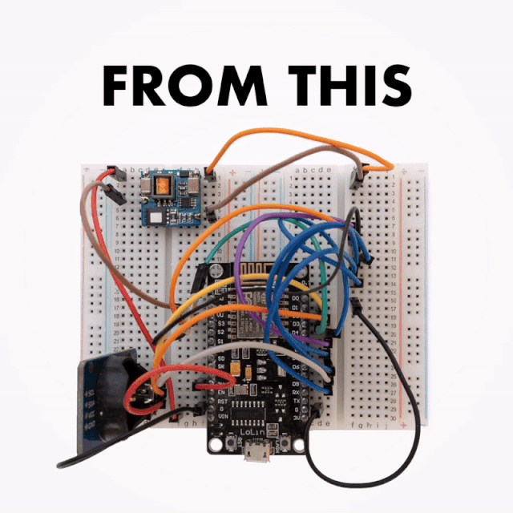
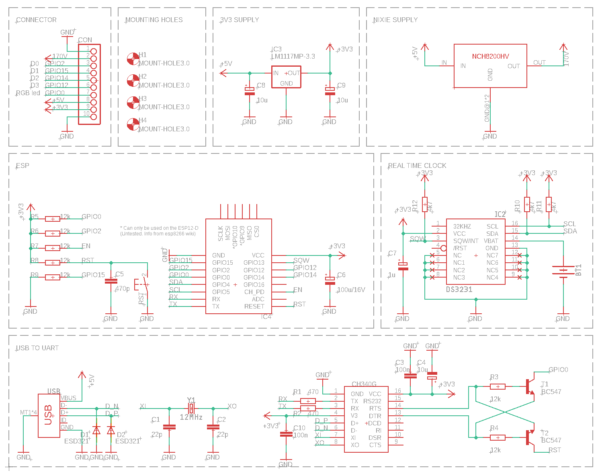
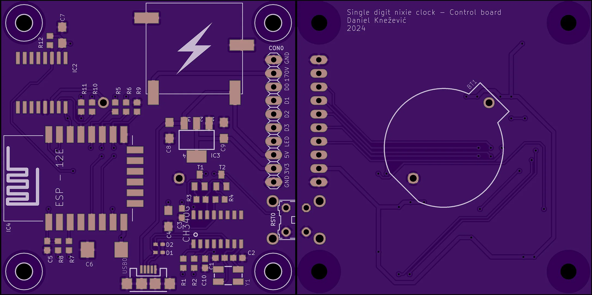

For proof of concept NodeMCU was connected with a DS3231 RTC module on a breadboard. This was enough to start working the firmware. Later, a PCB was created. The PCB is basically a re-packaged NodeMCU design connected with DS3231 and NCH8200HV high voltage boost module board.

## Schematic

## PCB
