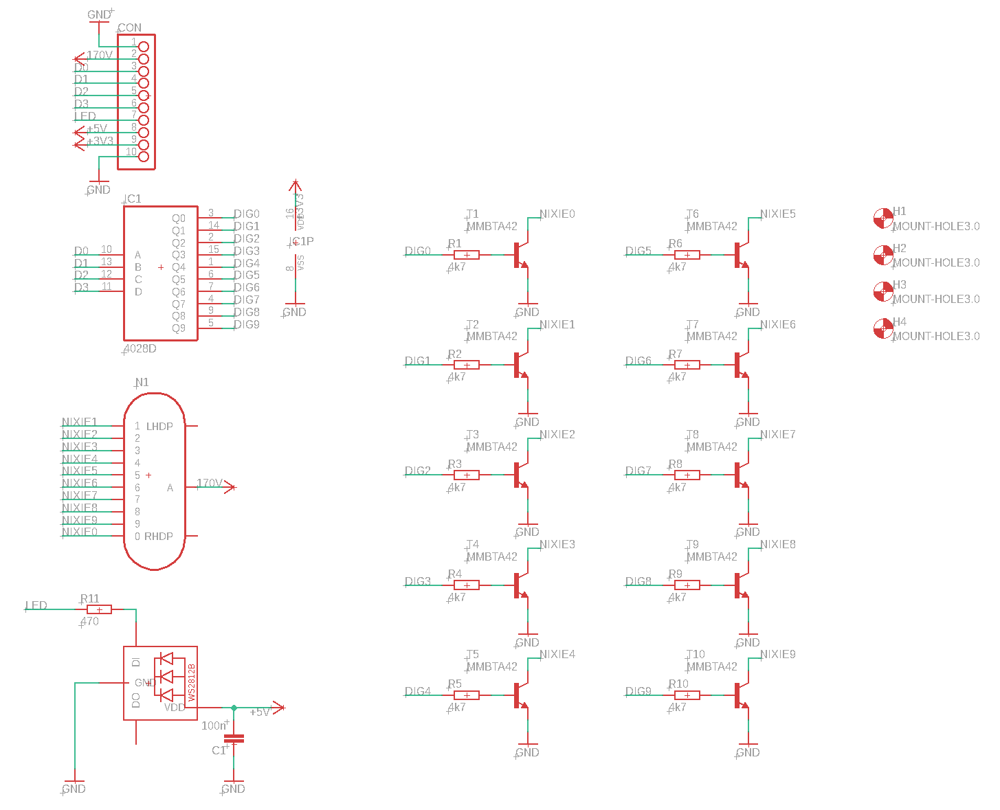
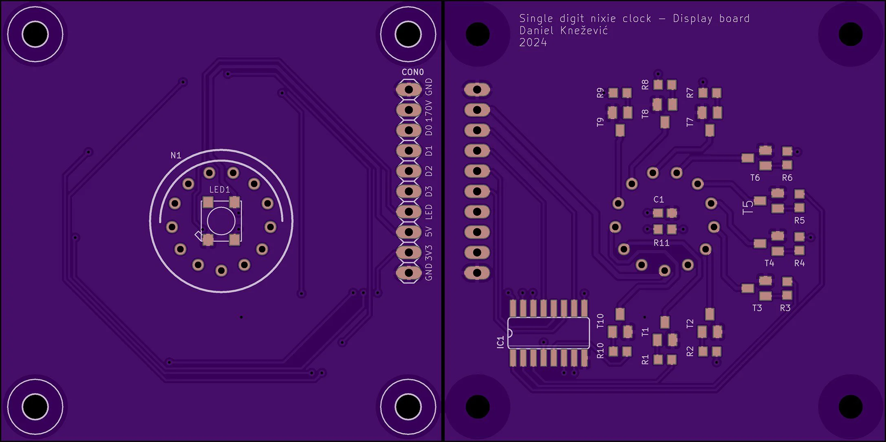

Display board uses a CD4028 BCD-to-decimal decoder. Its purpose is to reduce the number of required GPIO pins from 10 to just 4 for showing digits from 0 to 9. Compared to dedicated BCD to decimal decoder nixie drivers (like K511ID1),  the CD4028 is a widely spread component and it is available in SMD package. Since CD4028 has a voltage range from 3.0V to 15V it is not compatible with nixie tube’s operating voltage of 170V out of the box. This problem is solved with MMBTA42, a high voltage transistor, rated to more than 200V.

The rest of the display board consists of a WS2812B RGB LED and a pin header used to connect with the control board.

## Schematic

## PCB
