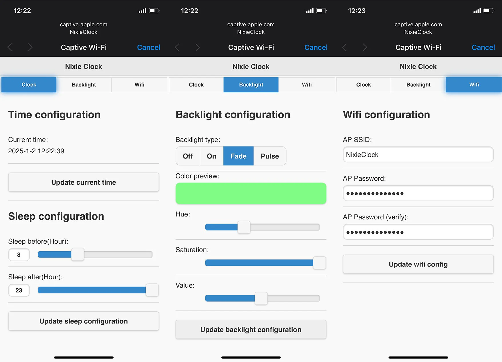
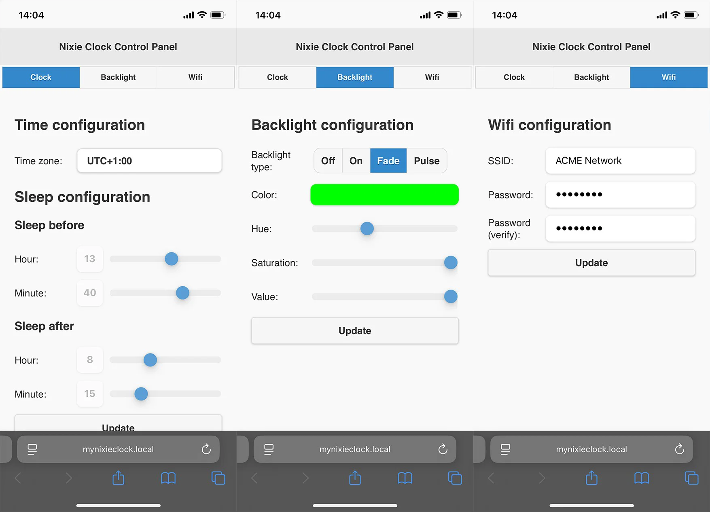

## Backend
Backend is implemented using ESPAsyncWebServer.

## Frontend design
Initially, the front end was implemented with jQuery mobile. Reason for choosing this framework was in its simplicity. It provides a simple way to create and control user interface components. One thing that always annoyed me was its low response time. It took too much time to load jQuery, jQueryMobile and theme resources. On top of this, this slow response time caused WDT resets.

One more thing, I just realised that  jQuery mobile project is deprecated since October 7, 2021. Huh, when it comes to web related technologies, it looks like I'm living under a rock...

To solve these issues, I opted to completely re implement the frontend using plain HTML, CSS and JavaScript. The end result looks almost the same as the previous design or even better. Responsiveness and stability increased significantly. The only drawback is now in maintenance and extension. It is required to implement everything manually.

### Size comparison
| jQueryMobile implementation | Custom implementation | Improvement |
|-----------------------------|-----------------------|-------------|
| 404kB                       | 32kB                  | **1262,5%** |

### Performance comparison
| jQueryMobile implementation | Custom implementation | Improvement |
|-----------------------------|-----------------------|-------------|
| 8695mS                      | 879mS                 | **988%**    |

### Design comparison
jQuery mobile design:

Custom design:
