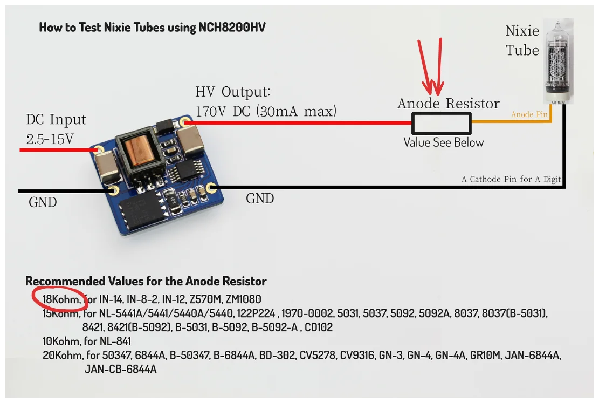
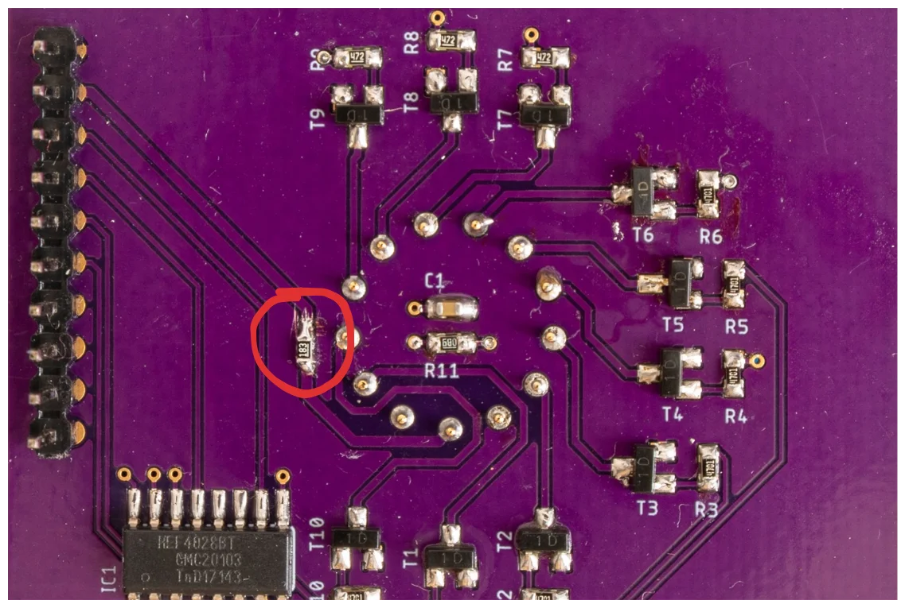

Recently, I decided to move schematic & PCB designs from the good old, but sadly dead EaglePCB to KiCAD. I found this exercise good for learning how KiCAD works. While I was replacing components with ones from KiCAD I double checked data sheets and docs… Documentation for [NCH8200HV](http://omnixie.io/nch8200hv.html) has a wiring diagram describing how to connect a nixie tube to the 170V supply module. In the picture below there is an anode resistor that is used as a current limiter. I completely missed that. That’s the reason why the digits were too bright. The second thing I learned is to never over current Nixie tubes.

To solve this issue, I cut the 170V trace on the display board and soldered an 18K resistor in series:
