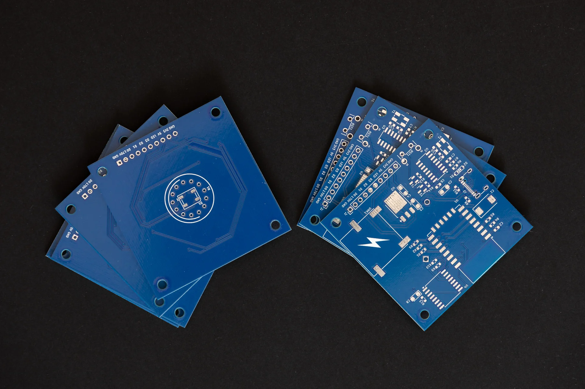
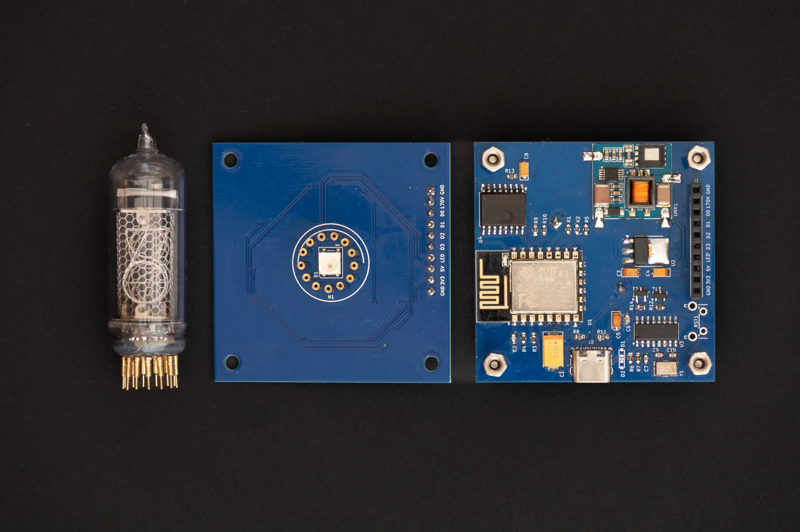
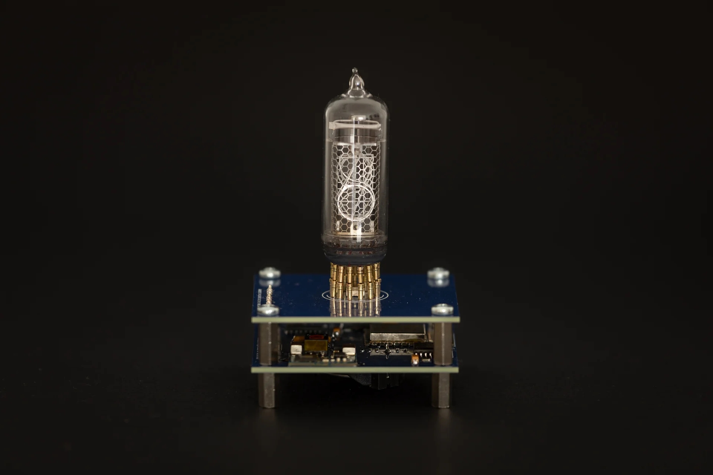
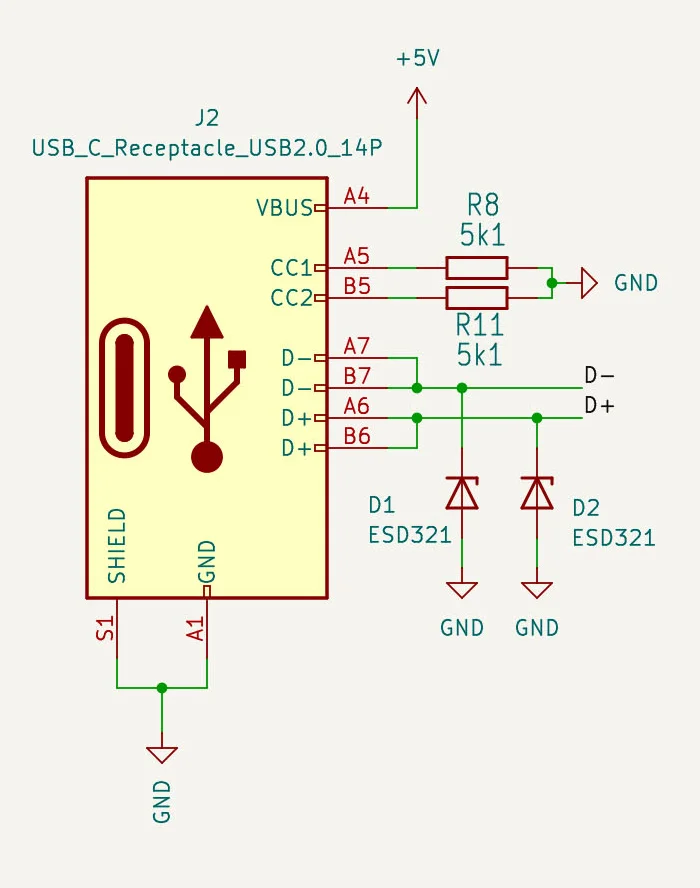
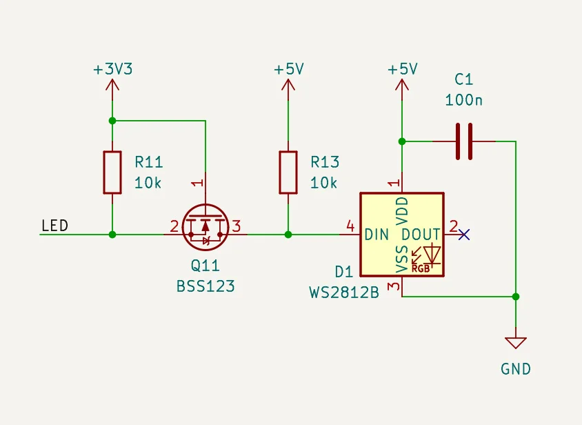
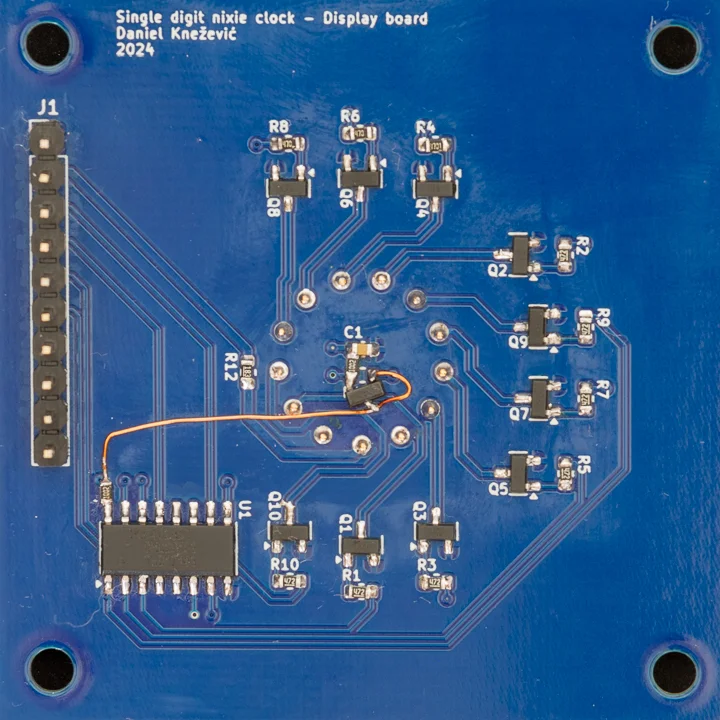

**A huge thank you to PCBWay for sponsoring this run of PCBs!**

How does this story go?

A representative from PCBWay contacted me because he was deeply impressed by my project and offered to sponsor a batch of PCBs to test out their services. 

Firstly, I was surprised since no one ever showed interest in my personal projects. He was very kind to explain what they offer through the sponsorship and we made a deal.

I have to be honest, I was a bit sceptical how this would go. It turned out they were very professional by sending the boards and paid all necessary costs including delivery. In addition to this, I have to praise simple and easy ordering through their website.

Since I recently moved to KiCad, it was a perfect opportunity to try out the [PCBWay Plug-in for KiCad](https://github.com/pcbway/PCBWay-Plug-in-for-Kicad). It provides a simple way to place an order in just a few clicks. There is no need to bother with exporting gerber files, everything is automated. You just need to update the PCB specification and fill in the shipping information on the webpage. That’s it.

Another useful tool is [PCBWay’s online gerber viewer](https://www.pcbway.com/project/OnlineGerberViewer.html), it is good for double checking all the exported files and to use images of PCBs in documentation.

The entire journey from placing the order to receiving the package took less than a week. Incredible! PCBWay did a superb job, PCBs are amazing.

Assembled PCBs:

Stacked PCBs:

## Updates on Control board

Micro USB connector has been replaced with a type C connector. Nowadays, it is much easier to find type C cables at our desks because almost all devices switched to it. Despite it being harder to solder this connector without stencils, I found this change a logical step to keep up with current trends.

Here is the updated part of the control board:

The control board schematic is updated in the project's details.

## Lessons learned from this batch

Weird behaviour of the WS2812B RGB LED:


I initially thought the problem was in micro USB connectors because the problem occurred with some cables. But, then I realised the problem might be in the fact that WS2812B is rated to 5V and the signal coming from ESP is 3V3. The LED worked on the breadboard while I was experimenting. I remember, I read somewhere that’s fine… But, it isn’t. To fix this issue I’ve added a level shifter before the DIN pin of the RGB LED:

Here is my botched PCB:
