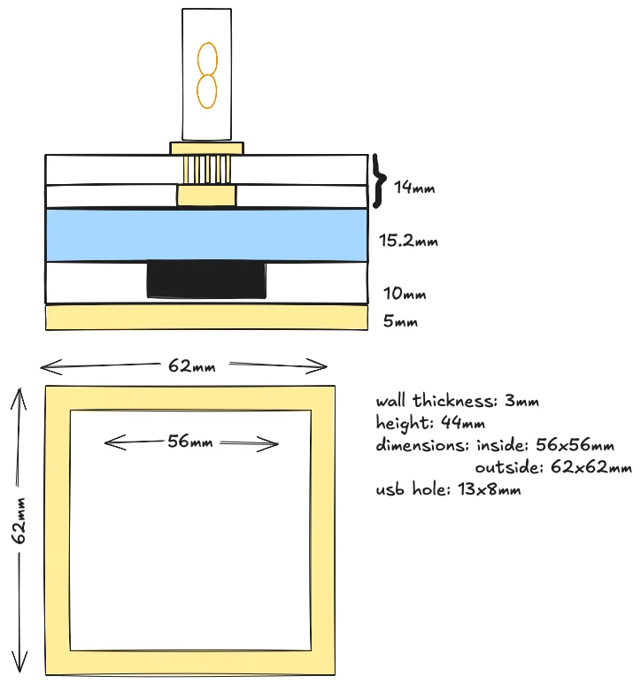
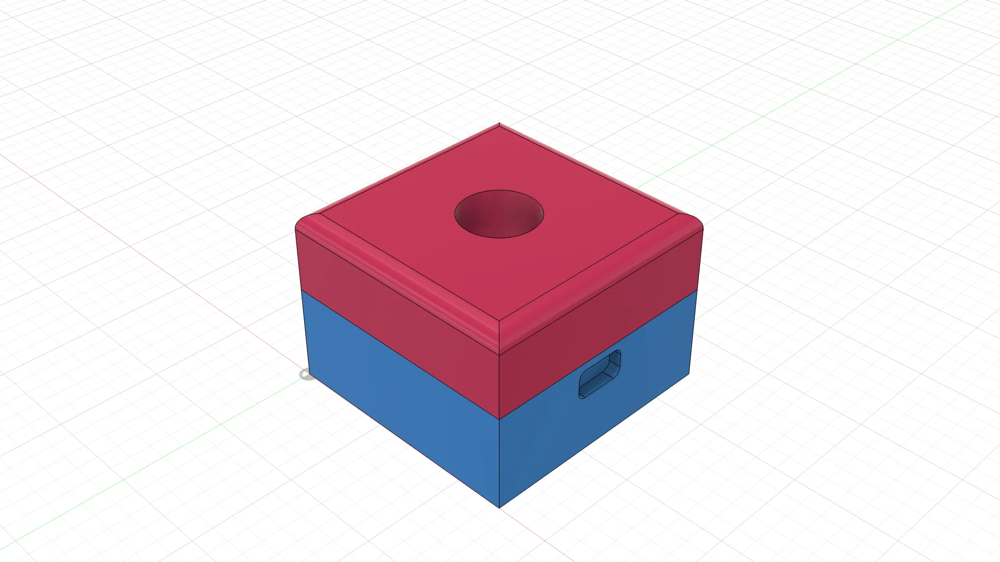
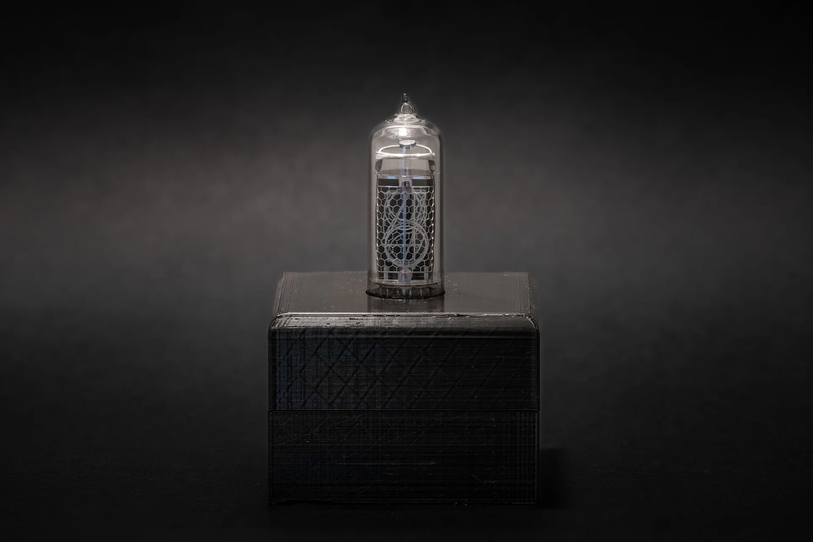
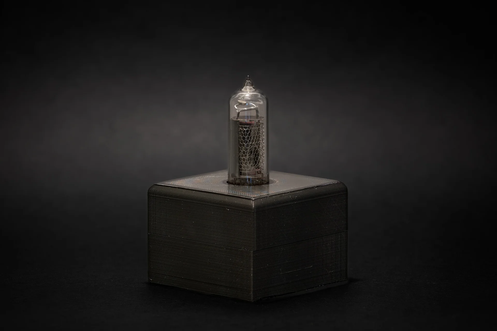

A product without an enclosure is not a complete product. While I enjoy looking at PCBs with all the components of the nixie clock, for others it might be just a dust magnet. The last puzzle piece to complete this project is moving the electronics into a box.

First step is measuring, then getting a rough idea about case dimensions and thickness:

Second step is CAD, making a design. I opted for a simple box shaped design with holes for the nixie tube and USB connector.

3D printed prototype:

Next step is to think about what material to use and how to make the case more interesting...