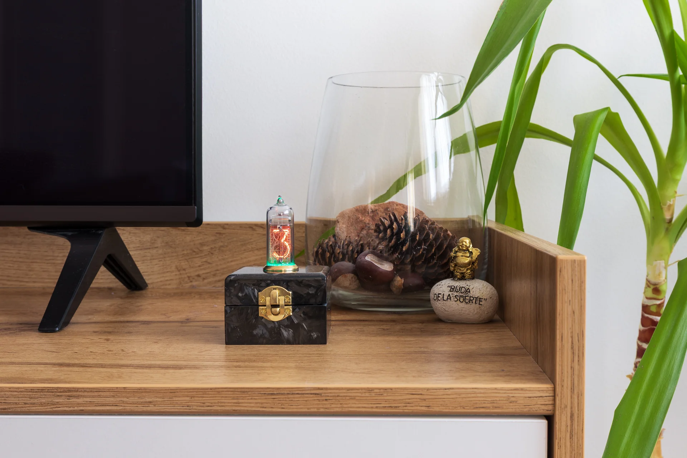
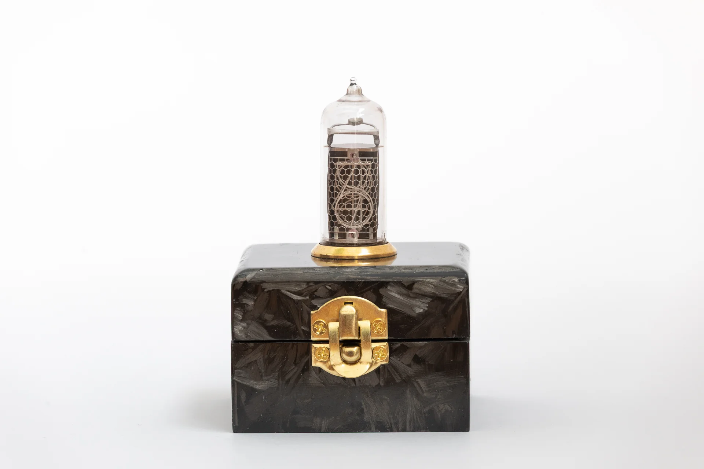
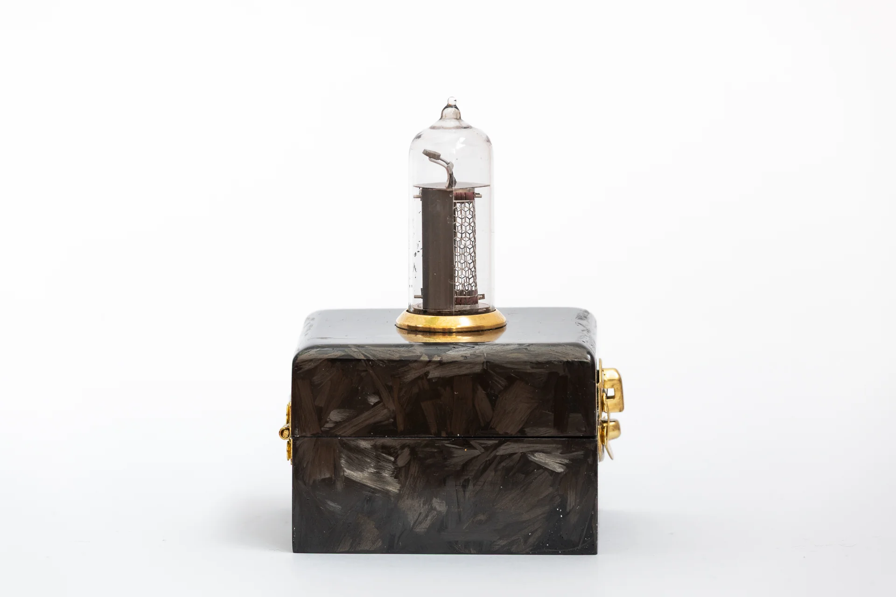
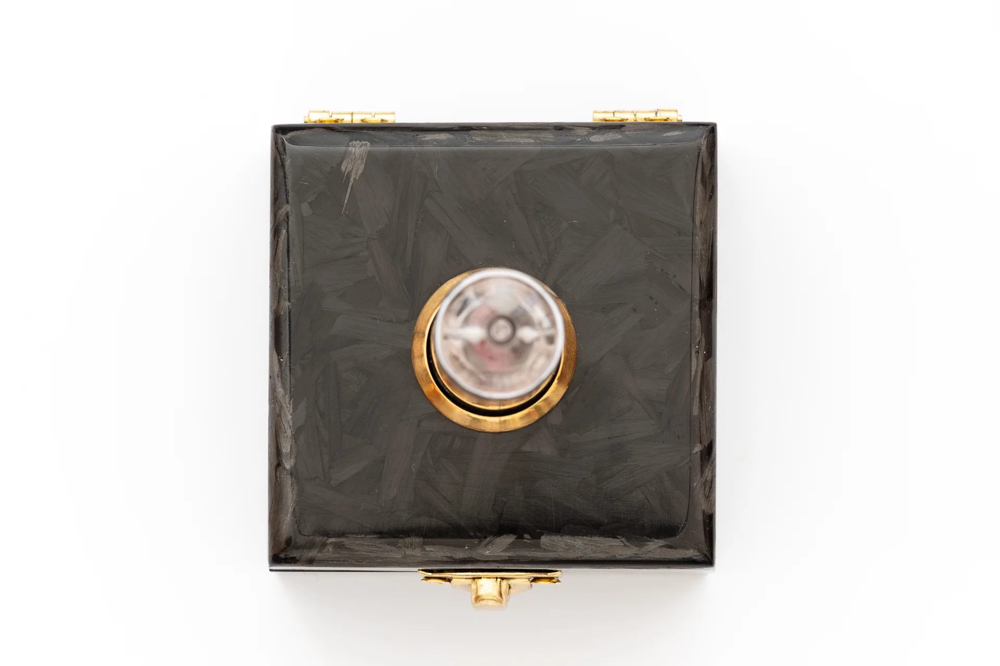
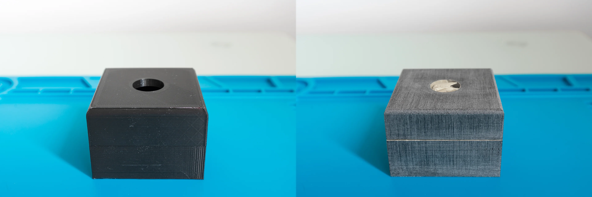
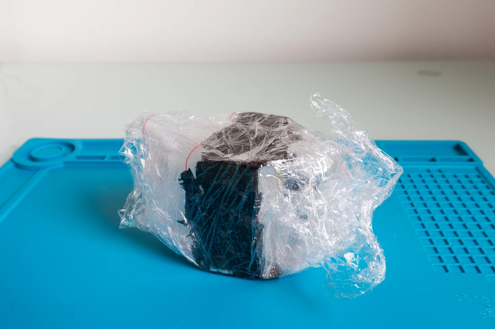
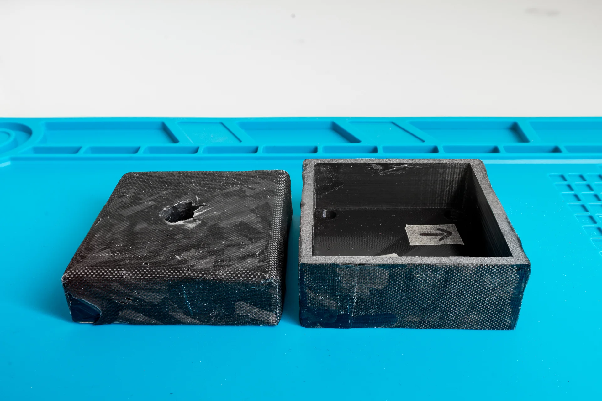
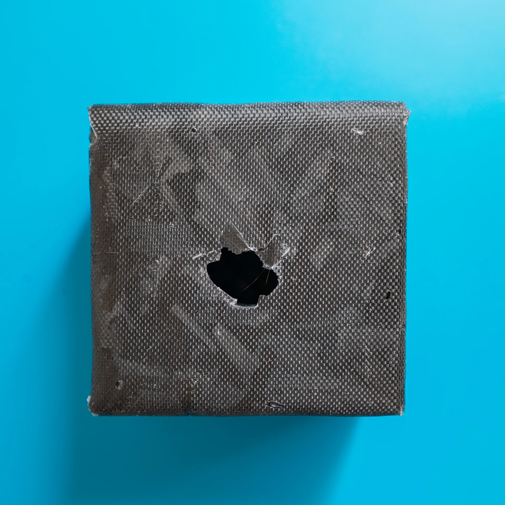

The 3D printed case was just a path finder, to get a rough feeling about the shape and size. Originally, I planned to make the clock’s case out of wood (oak or walnut) and decorate it with brass bits and pieces to resemble a jewellery box. Then, I realised that almost all nixie clocks are boxed either in a wooden or acrylic box.

Since the title states this project is an “artistic clock” I wanted to make something to stand out from others besides having only one nixie tube.

Here is the finished product in its natural habitat:

The end result is a 3D printed box skinned with chopped carbon and decorated with brass pieces (hinges, ring and latch). The inspiration came from super cars. More and more super (hyper) cars have forged carbon parts. I find this look interesting, dark grey carbon fits nicely with brass. The whole project is a combination of old and new technology, the same case is with the packaging.

More pictures:

## This is how I did it

1. I started with the 3D printed box, sanded it with a 100 grit sand paper to remove printing marks and to prepare the surface for epoxy.

2. Coated the plastic piece with epoxy, covered it with carbon flakes and finally wrap it with peel ply. At the end I covered everything with a nylon foil.

3. Removed peel ply and cut the excess carbon & epoxy:

4. Finishing: little touch ups, sanding and polishing.
To flatten the faces I used 100-180 grit wet sand papers. Then, I filled the low spots with epoxy. After curing, I continued with sanding with 180, 240, 320, 400, 600, 800, 1000, 2000 grits. Finally, the last step was to hand polish surfaces with 3M fast cut polishing compound.