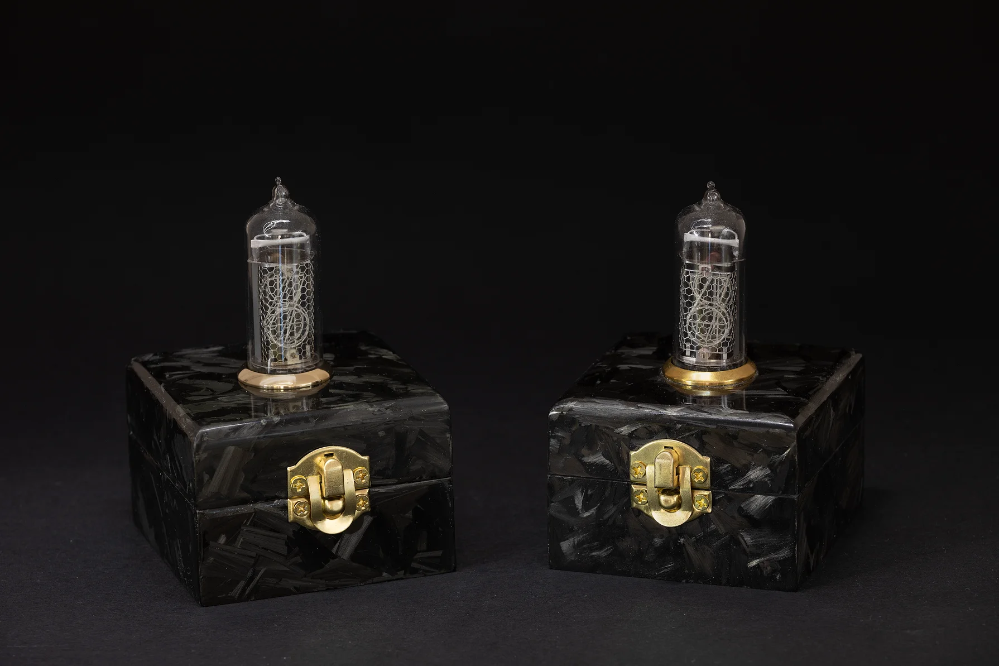
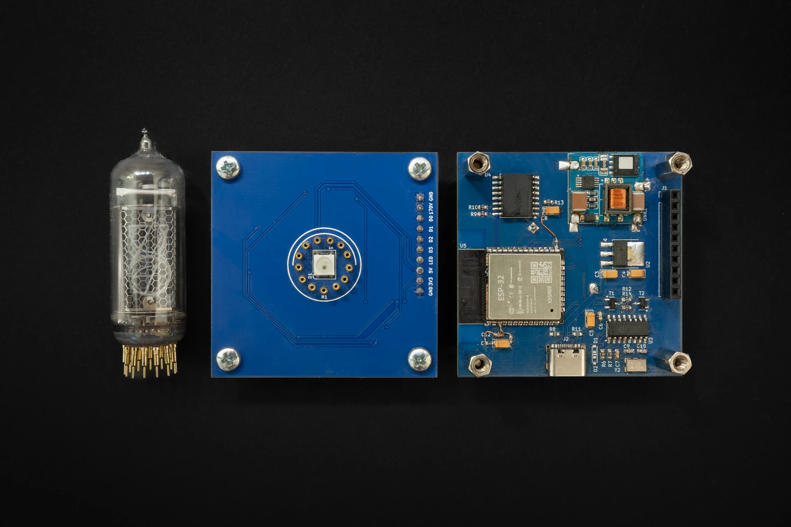
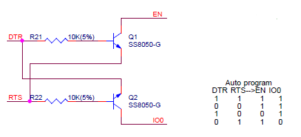
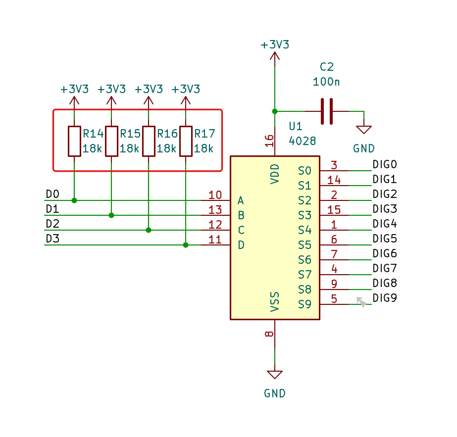

Although these two clocks look identical on the outside, everything under the hood has been redesigned and improved - from the hardware to the firmware. Only the case design stayed the same, but its finishing has improved too.

Version 2.0.0 comes with the following set of changes:
- Improved performance and reliability.
- Removed manual daylight saving time handling from the GUI.
- Easier time zone selection based on city/country.
- Added option for choosing 12 hour time format.
- Added support for various Wi-Fi encryption types.
- Added RGB fade effect to LED at startup.
- ESP8266 has been swapped with the ESP32-WROOM-32 module.


**A big thank you to PCBWay for sponsoring this project and providing PCBs for the new version of single digit nixie clock.**

As I described in the documentation, the possibility of switching to ESP32 came to realization. I made the switch for a couple of reasons:
- It is a good opportunity to get familiar with ESP-IDF
- It has Bluetooth that can be used for new features

Besides this, I had a major problem with the previous implementation of the nixie clock. The ESP8266/Arduino combo had an issue with random restarts originating from third party libraries. To be more precise ESPAsyncWebServer. System restarts occurred when certain functions or loops became unresponsive during periods of slow Wi‑Fi connectivity, causing the watchdog timer (WDT) to trigger. To solve this problem I decided to make radical changes. Instead of finding a better Arduino library for the web server I decided to get rid of the Arduino framework with 3rd party libraries and use the SDK provided by Espressif. There was an option to use the ESP8266 RTOS SDK, but I opted to switch to ESP32 and use ESP-IDF instead. ESP-IDF is more future proof, so there is no point in using something outdated.

The SDK contains everything I need for this project: HTTP server, mDNS server, SNTP support, RMT for RGB LED, … it made porting the old code to ESP32 easier.
As a result, the firmware became more robust and stable. The above-mentioned crashes disappeared. ESP-IDF’s implementation of standard C time functions, which are POSIX-compatible, simplifies time and time zone management. The system automatically calculates local time based on the user-configured time zone, including daylight saving adjustments, so there is no need for manual handling on the front-end. 
Using FreeRTOS tasks for handling the LED and Nixie tube simplified the code and improved readability. 

## Hardware changes

The control board has been slightly redesigned to use the ESP32-WROOM-32 module. While ESP32 has better support for time keeping, compared to ESP8266, I still left the RTC and external battery on the board. External RTC can be used for storing the current time for cases when the device is not connected to the internet.



### Issues & Fixes

#### Control board

Control board had an issue with the auto-programming circuit. While the serial monitor worked fine, flashing firmware with `esptool.py` always failed with the following error:

```
A fatal error occurred: Failed to connect to ESP32: No serial data received.
```

As a quick fix, I manually entered programming mode by shorting the IO0 pin to ground while `esptool.py` displayed the `Connecting........` message.

It is a know issue based on online articles/forums manifesting as a timing issue. Entering programming mode requires a specific sequence of EN and IO0 signal transitions. A common fix is adding a capacitor (100 nF – 10 µF) between EN and GND. However, this did not resolve my issue.

To debug further, I used a small Python script to toggle the RTS and DTR pins on the CH340 while monitoring EN and IO0 signals at ESP32 with a multimeter.


Here is the auto-programming circuit with its truth table:


According to the truth table, when DTR is low and RTS is high, the ESP32’s EN and IO0 pins should be inverted (EN = high, IO0 = low). On my setup the actual results were not matching expected values. I looks like pull up resistors were missing on these pins. Adding them fixed the programming issue. As a good measure I've added a 100nF ceramic capacitor between EN and GND.

Here is the Python script:
```python
#!/usr/bin/python3
import serial
import time
import sys

if len(sys.argv) != 2:
    print(f"Usage: {sys.argv[0]} <serial_port>")
    sys.exit(1)

port = sys.argv[1]

try:
    ser = serial.Serial(port, baudrate=9600)
    print(f"Toggling RTS/DTR on {port}. Press Ctrl+C to stop.")

    while True:
        ser.rts = True
        ser.dtr = False
        print("RTS: HIGH, DTR: LOW")
        time.sleep(10)
        ser.rts = False
        ser.dtr = True
        print("RTS: LOW, DTR: HIGH")
        time.sleep(10)

except KeyboardInterrupt:
    print("\nExiting...")

finally:
    ser.close()
```

#### Display board

During boot, the display board showed a glowing “1” digit, even when no digit should be active. This was caused by floating input pins on the CD4028 BCD-to-decimal decoder.
To fix the issue, I added pull-up resistors to the CD4028 input pins so that the default input state is `0xF`, which results in all outputs being low.



## Case

The case design remained unchanged, but the carbon flake finish has been improved a bit. Since the 3D-printed box was light grey, I needed to ensure every surface was fully covered with carbon. The good thing is, it is easy to fix gaps by adding a new layer of carbon and epoxy.
