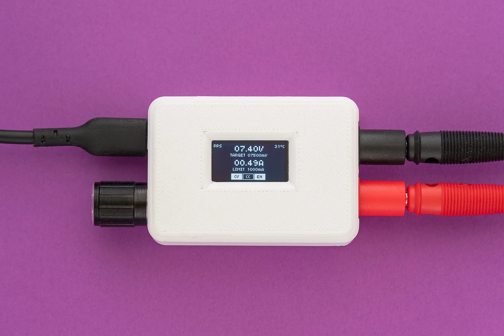
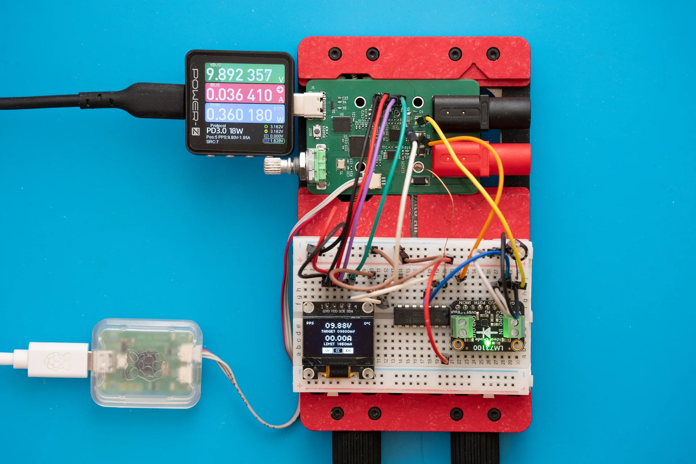
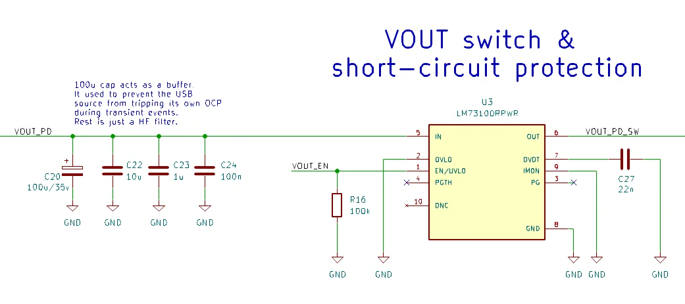
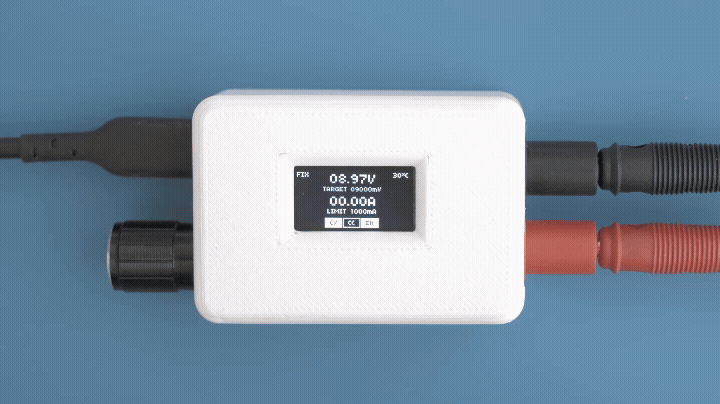
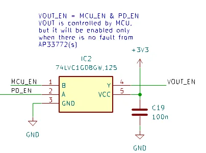
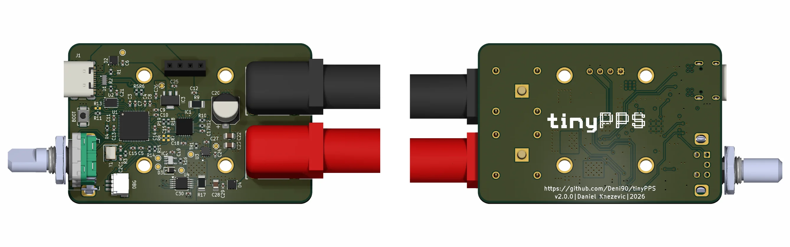
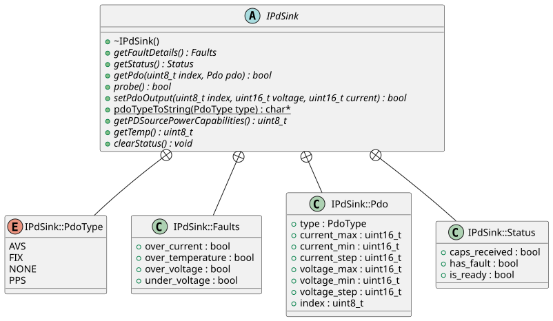
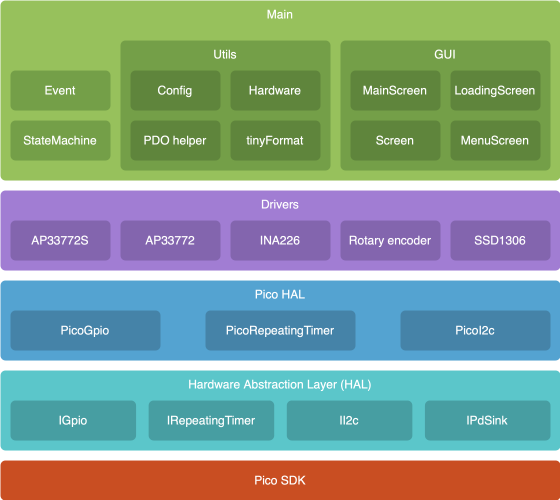
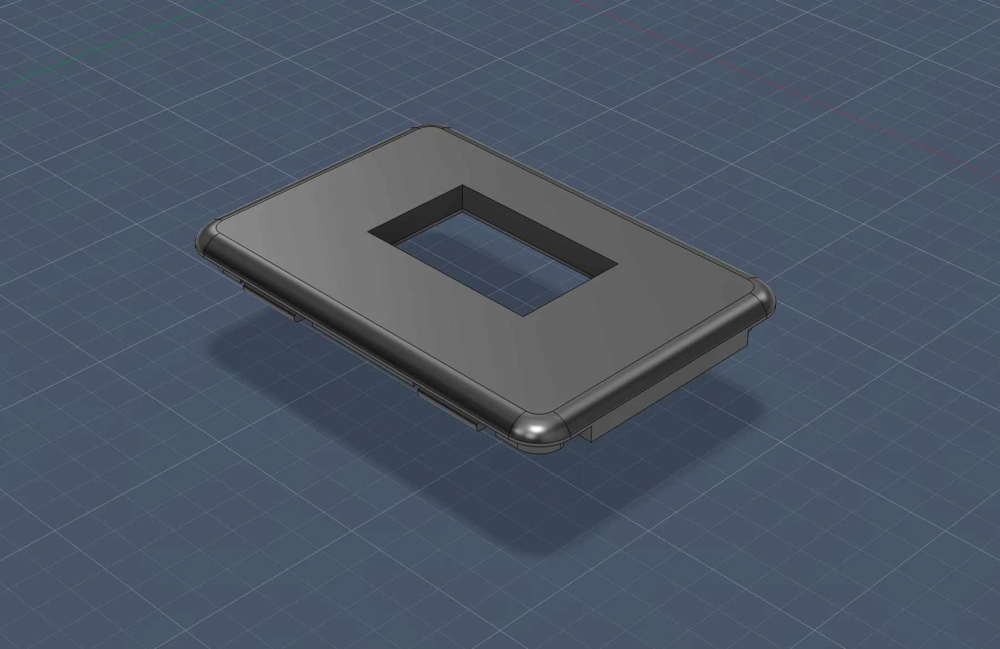
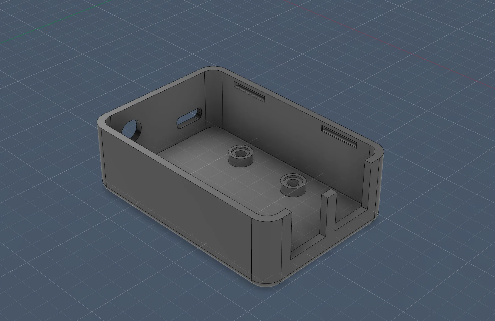

## Introduction



Over the past few months, I worked on improving TinyPPS. As a result, almost every part of the project is changed and hopefully improved.

This article describes the key design changes made in version 2, including changes in the schematic, a PCB redesign with a transition to a 4-layer stack-up, and firmware improvements.

Cherry on the top is that I even managed to allocate some time to make a 3D printed case.

## Hardware

Although I’m primarily a software engineer, I spent weekends building my hardware design knowledge for better understanding and fixing the issues identified in previous revision.

### Changes in the schematic

When changing the schematic these were the two main goals:
- Add short-circuit protection to TinyPPS.
- Support the older AP33772 PD sink IC to enable finer voltage/current steps. This can be useful for implementing new features.

The test rig included a frankensteined v1 PCB connected to a protoboard containing new components:



#### Short-circuit protection
Short-circuit protection (SCP) is not critical for TinyPPS, but is a nice addition. I say not critical because majority of USB chargers (if not all) have built in protections that are keeping our devices safe. For the version 1, in case of SCP, TinyPPS will reset. This reset is caused by a reset on the USB source side. A better solution would be to detect SCP on TinyPPS and disable VOUT uppon detection. Since AP33772S doesn't have SCP protection, additional components are needed. But, adding new components on such a small real estate is becoming harder and harder challenge.

Here comes LM73100 to rescue the situation. LM73100 is an integrated ideal diode with input reverse polarity and
overvoltage protection. It has a built-in short-circtuit protection, switchable output and it is rated for 5A. Input reverse polarty is a bonus feature.



A single LM73100 can replace the back-to-back NMOS switch, with one caveat. The PWR_EN signal from the AP33772S acts as a gate driver and exceeds the LM73100’s absolute maximum voltage rating, so it cannot be connected directly to the enable pin.


Because the PWR_EN voltage scales with the PPS output and remains higher to fully enhance the NMOS, a simple resistor divider is not sufficient. Instead, a 3V6 Zener diode is used to clamp the signal to a safe level.

Fixing one thing often breaks something else. In this case, addition of SCP results in dropping AVS feature. True to its name, TinyPPS now supports only PPS voltages (3.3 to 21V) due to LM73100's maximum operating voltage of 23V. Seems as an acceptable compromise.

Short circuit protection in action:


#### AP33772 support

This is a straightforward change. As the AP33772 and AP33772S share the same pinout, no major hardware modifications are required.

Differences between AP33772 and AP33772S:
- Shunt resistor: AP33772 requires a 10 mΩ shunt resistor while AP33772S requires 5 mΩ.
- VOUT control: While AP33772S has an option to manually enable/disable the output via the VOUTCTL bit in the SYSTEM register, the AP33772 enables the output automatically upon successful PD negotiation. To support both ICs and have the same feature for manual output handling, an AND gate is added between the AP33772(S) PWR_EN signal and the LM73100 enable pin. The AND gate combines the PWR_EN signal with an RP2040-controlled enable signal, forming the final enable for the LM73100. Another benefit of the AND gate is that the output is disabled by default.

    

    The output (Y) of the AND gate is connected to RP2040 input pin and its value is used in combination with INA226 to handle faults like short-circuit. If the output is enabled but the INA226 reports 0V, it indicates that the LM73100 has shut down, likely due to a short circuit. In this case, the system disables the output.

    **Note:** For AP33772S, it is important to leave VOUTCTL bit unchanged - set to 0.
    

#### Misc

Additional, minor hardware improvements include:
- Added test points for the VOUT traces and the AND gate inputs/outputs to simplify debugging and measurement.
- Added placeholders for I2C pull-up resistors to enable testing wihout OLED.
- Added TVS diodes to input and output power paths to protect the system from voltage spikes and transients.

### PCB design

A major change in the PCB design is the stack-up, moving from 2 layers to 4 layers. The 4-layer stack-up is arranged as signal, ground, power, signal. The intention was to improve signal integrity by providing a continuous ground reference and reducing noise compared to a 2-layer design.

Besides this, I calculated trace widths for signal lines and USB differential pairs to meet target impedances based on the stack-up and improved decoupling capacitor placement.

All this is done to build better foundations for firmware development.



## Firmware

Any change in hardware must be followed by corresponding firmware updates. While the initial goal was to add support for the AP33772 and its feature set, maintaining compatibility with the existing AP33772S implementation, the work ultimately resulted in a complete firmware overhaul.

### A complete firmware overhaul

While I was waiting for new PCBs to arrive, I used that time to make changes to the firmware:

- The `TinyPPS` module (now renamed to `StateMachine`) always bothered me. While other modules were "nicely" designed, the `TinyPPS` module contained a state machine based on a switch/case. This state machine served its purpose well for the initial implementation, but it was a messy spaghetti code. To address this, I switched to an event driven state machine using `std::variant` and `std::visit`. Another change is in the hardware initialization, which is done in `main()`.
- Dependency on `std::format` was removed and replaced with a custom formatting function based on `std::snprintf` called `tinyFormat`. It turned out that the format library is quite large since it includes things like locale support that are not needed for my project [4]. Removing this resulted in a significant reduction of the flash image size from 1.3 MB to less than 250 KB. This is not a big deal cause a 2 MB flash is used, but why waste space on unnecessary stuff?!
- The driver code for INA226 in v1 was based on Arduino library[5]. For this version, I reverted back to my custom solution and fixed the calibration code following equations in the datasheet. This way, the project is not depending on third party code/libraries except for the picoSDK.
- Dynamic memory allocation for screens was replaced with a static buffer. The buffer is shared across all screen instances and is allocated once at startup.
- I ran the firmware code through a linter (clang-tidy) to detect potential issues and guide the adoption of modern C++ practices, resulting in cleaner and more maintainable code.

### Designing firmware to support AP33772 and AP33772S

To simplify integration of the AP33772 into the main codebase, an interface (IPdSink) was created to represent a generic USB PD sink IC. It defines the necessary structures, enums, and functions required to describe such a device. This interface can also be reused in the future to support other USB PD sink ICs.



Both the AP33772 and AP33772S implement the IPDSink interface, allowing the main module to remain unaware of the specific device in use after initialization. For the AP33772S, this required only refactoring the existing implementation, while the AP33772 was implemented from scratch based on the datasheet.

The main() holds instances of both the AP33772S and AP33772 drivers. At runtime, the correct one is selected based on the detected I2C address (via the `probe()` function). This allows a single firmware build to support both IC variants, despite differences in feature sets. Since the two ICs are pin-compatible, this approach avoids maintaining separate firmware versions and reduces the risk of flashing the wrong firmware.

Keeping both instances pre-created simplifies the design in an embedded context:
- It avoids dynamic memory allocation
- It ensures deterministic initialization
- It eliminates the need for runtime object construction or complex lifetime management
- This approach favors predictability and simplicity over resource usage

Updated firmware organization atfer refactoring with Added IPdSink and AP33772:



## Board bringup

Bringing a newly assembled PCB to life is always the most challenging part of a project. At this point, months of research, schematic design, PCB layout, component selection and assembly are put to the test. There are so many factors that can influence the outcome.

With the experience from v1, I started inspecting the assembled board for solder bridges and fixing them. After that, I hooked up the device to power supply and verified the 1V1, 3V3 and 5V rails using test points (I missed to add a test point for 1V1).

Next step was to flash RP2040 with a simple test firmware that toggles a GPIO pin (same as a LED blink test) to verify the RP2040 is alive. Flashing passed, but the GPIO pin remained at 0V. RP2040 was dead. The only difference between v1 and v2 is in the flash chip packaging and routing: v2 uses a smaller 2x3mm SOIC package and there is a via on the QSPI_SD3 pin.

To narrow down the issue, I flashed the test firmware directly to RAM, bypassing the external flash. Surprisingly, the behavior remained unchanged. This indicated there was clearly an issue, but it might not be related to the flash.


After some time digging and using AI as a rubber duck, I found a solution. The project was configured for a predefined RP2040 board definition, which clearly did not match my custom hardware. Changing the board type in the CMake configuration to `none` resolved the issue:

```cmake
set(PICO_BOARD none CACHE STRING "Board type")
```

With the test firmware working, it was time to flash the TinyPPS firmware onto the RP2040. As expected, it did not work on the first try. It turned out, during PCB design, I changed the I2C pins to make routing easier. But I forgot to leave a note about this change to my future self.

At the end, everything worked as expected. The happy end :)

## Case

For TinyPPS, I wanted to create a simple and minimalistic box-shaped case with rounded corners. The case features a snap-in lid that hides the mounting screws used to secure the OLED and PCB to the bottom part of the case.





The case is printed with ABS so it can handle higher tempeatures.

Here are some photos of the building blocks and the case:


## Key takeaways

- Even the AP33772 is marked as "not recommended for new designs", the project's future is still safe since it supports the newer AP33772S. The only tradeoff is in the adapting feature set.
- TinyPPS gained useful short-circuit protection, but at the cost of dropping AVS support.
- By using the older variant (AP33772), a new feature is unlocked: *constant current mode*. It will be implemented in the future. Stay tuned for the next project log.

## References

1. [AP33772 Datasheet](https://www.diodes.com/datasheet/download/AP33772.pdf)
2. [LM73100 Datasheet](https://www.ti.com/lit/ds/symlink/lm7310.pdf)
3. [74LVC1G08 Datasheet](https://assets.nexperia.com/documents/data-sheet/74LVC1G08.pdf)
4. [forums.raspberrypi.com](https://forums.raspberrypi.com/viewtopic.php?t=351089)
5. [RobTillaart/INA226](https://github.com/RobTillaart/INA226)
