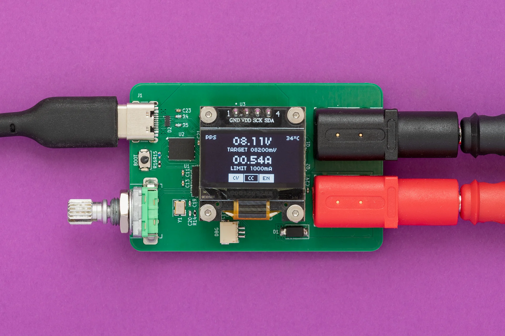

Key features:
- Support for fixed PDO, PPS and AVS profiles
- Output voltage range: 3.3V to 28V
- Fine-grained voltage adjustment via PPS negotiation *(100mV/Step)*
- Output current up to 5A *(charger and cable dependent)*
- Programmable current limit *(250mA/Step)*
- User-switchable output

For a detailed look at the schematics, PCB design and firmware, visit the [GitHub repository](https://github.com/Deni90/tinyPPS).

## Sponsor time

Huge thank you to **[PCBWay](https://www.pcbway.com)** for providing me PCBs and SMD stencil for free.

PCBWay offers high-quality PCBs at affordable prices. The boards are ready to solder straight out of the box, with no leftover tabs that need to be sanded down.
Ordering is super easy: just upload the Gerber files and select the desired parameters.

What I like most is their customer support. They are quick to review orders and don’t just point out issues - they provide detailed explanations on how to address them. Whether it is about a missing Gerber file or out of capabilies issue. At the end, the outcome is always positive.

## Project logs