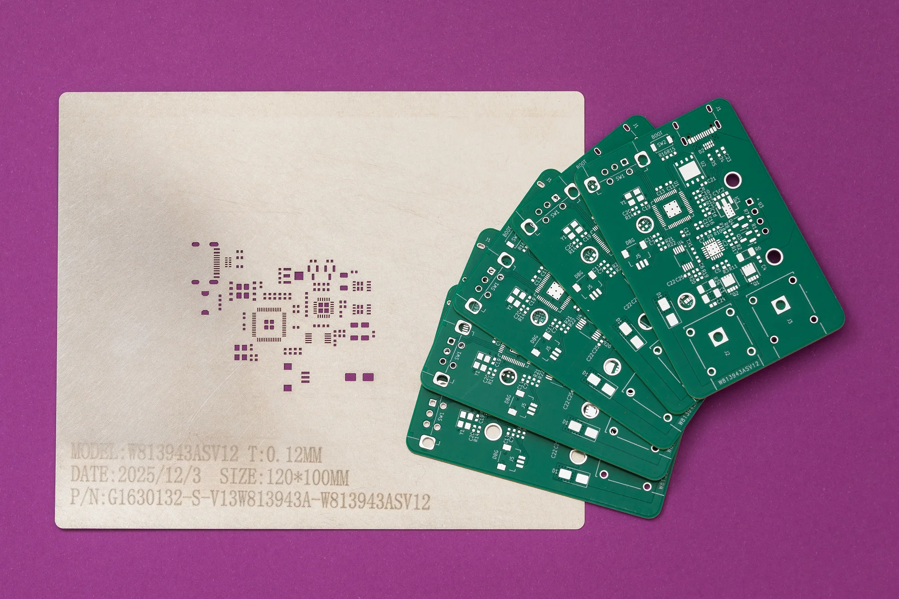
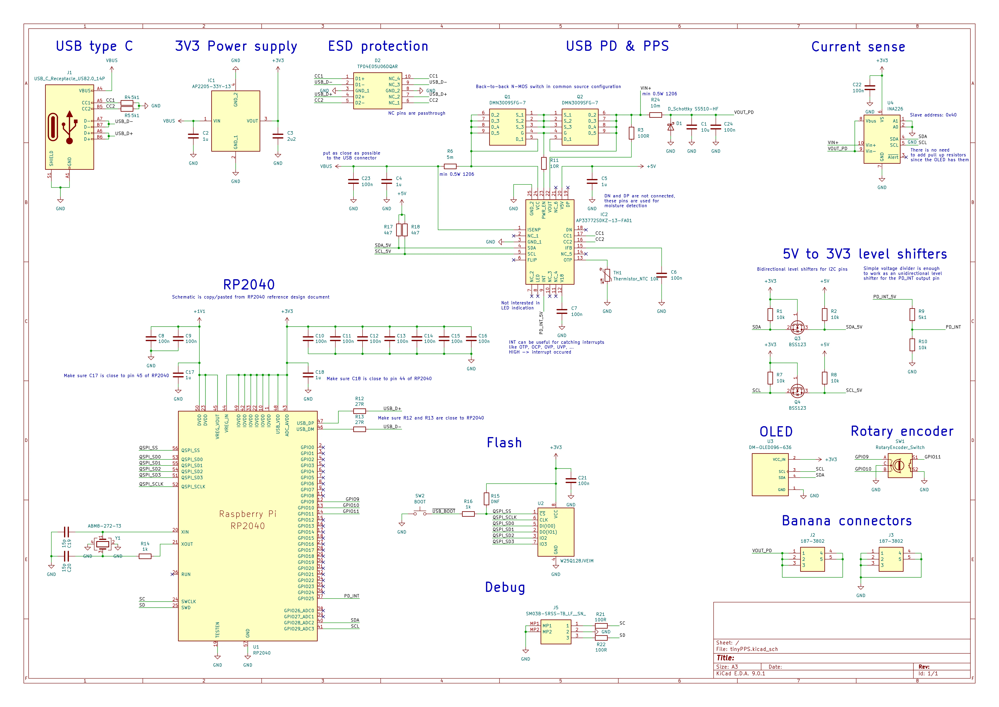
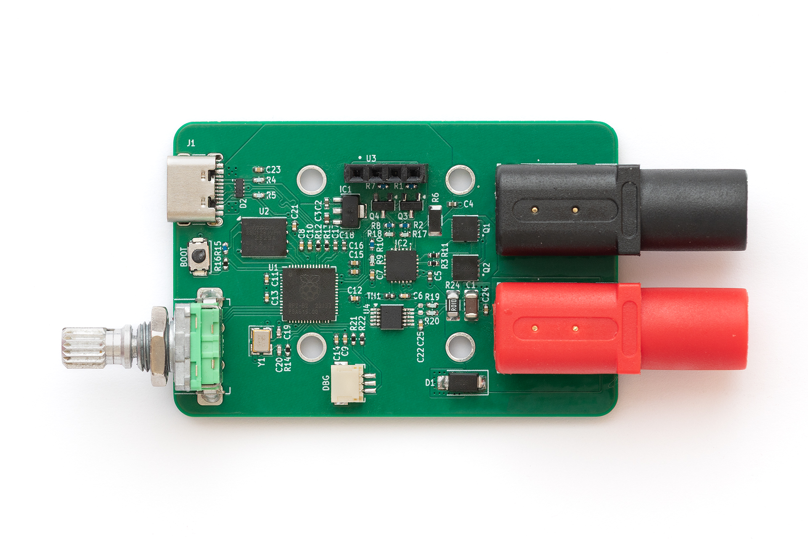
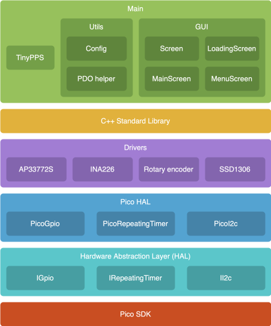
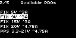
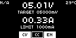

Key features:
- Support for fixed PDO, PPS and AVS profiles
- Output voltage range: 3.3V to 28V
- Fine-grained voltage adjustment via PPS negotiation *(100mV/Step)*
- Output current up to 5A *(charger and cable dependent)*
- Programmable current limit *(250mA/Step)*
- User-switchable output

For a detailed look at the schematics, PCB design and firmware, visit the [GitHub repository](https://github.com/Deni90/tinyPPS).

## Idea

Everything started with buying a 15$ USB powered mini SMD hot plate that required a supply with the following capabilities: PD65W 20V 3.25A. By acquiring a 100W power supply I have found out something called PPS, beside regular voltage/current values, on the label. 

**PPS 3.3V-21.0V - 5.0A 100W max** - tickled my brain. What is PPS? It turned out it is a neat USB-C feature. To be more precise, it is an advanced feature of the USB Power Delivery (USB PD) 3.0 standard that allows chargers to dynamically adjust voltage and current in real time. Unlike standard PD, which uses fixed voltage "steps" (e.g., 5V, 9V, 15V, 20V), PPS allows for fine-grained adjustments - typically in 20mV voltage increments and 50mA current steps.

Knowing this, I came up with the idea of using USB PPS to build a small “lab” power supply as a proof of concept. Before jumping in to realization, I explored existing solutions and stumbled upon [PocketPD](https://github.com/CentyLab/PocketPD) by Centylab. Although it’s a great product, I wanted to add my own twist and use the project as a learning experience by implementing my own solution.

## Sponsor time

Huge thank you to **[PCBWay](https://www.pcbway.com)** for providing me PCBs and SMD stencil for free.

PCBWay offers high-quality PCBs at affordable prices. The boards are ready to solder straight out of the box, with no leftover tabs that need to be sanded down.
Ordering is super easy: just upload the Gerber files and select the desired parameters.

What I like most is their customer support. They are quick to review orders and don’t just point out issues - they provide detailed explanations on how to address them. Whether it is about a missing Gerber file or out of capabilies issue. At the end, the outcome is always positive.

## Hardware

For this project I wanted to use a microcontroller family other than **ESP32**. Options were **Raspberry Pico**-series or **STM32**. Due to ease of use (mostly flashing) I have chosen the Pico - **RP2040**.

Since I am not really a hardware guy, the schematic is basically an amalgamation of a few reference designs - mostly RP2040, AP33772S and INA226, with an OLED, rotary encoder and some extra connectors added on top.

The Pico’s QFN package is already challenging to solder and the 0402 SMD components are the icing on the cake.

Schematic and PCB are designed in KiCAD:

*Open image in new tab for a better view*

This is the finished PCB without the OLED attached:

## Firmware

Firmware is organized in the following logical layers and modules:

### Pico SDK

The firmware is written in C++ (C++20) using the Pico SDK, running directly on the hardware without RTOS.

### Hardware Abstraction Layer (HAL)

HAL is created as a set of hardware independent interfaces for controlling microcontroller peripherals like: GPIO, timer and I2C.
It provides APIs that other components can use without knowing hardware details.
While this layer is not actually needed for this project, since it is running only on RP2040, the drivers for INA226, SSD1306, ... can be re-used on other projects.

For example: the driver for SSD1306 OLED display is already picked up from one of my previous projects.

### Pico HAL

This layer is on top of the generic HAL. It implements interfaces declared in the HAL using PicoSDK.
Besides `main.cpp`, Pico HAL is the only place where Pico SDK is used.

### Drivers

This layer defines modules for controlling peripherals attached to RP2040 via I2C bus or via input pins.
Each peripheral is represented as a class, providing a public API for controlling it by user code.

By looking at the schematic, the following modules can be identified as requiring driver code:
- **ap33772s**: Driver for the AP33772S USB Type-C PD3.1 sink controller.
- **ina226**: Driver for the INA226 Ultra-Precise I2C Output Current, Voltage, and Power Monitor.
- **rotary_encoder**: Driver for the rotary encoder. It uses a polling mechanism to read the encoder state. The rotary encoder driver detects multiple states, including rotary increment/decrement, short button press, long button press, and rotary movement while the button is pressed.
- **ssd1306**: Driver for the OLED display. The driver performs a partial display update using page-level dirty tracking. The display driver does not refresh the entire screen on every update. Instead, it keeps track of which display pages have changed since the last refresh. This results in shorter I2C transfer times, improving performance and reducing the time the main loop is blocked.

### Main

This layer is responsible for implementing the business logic, in this case, the power supply logic. This layer relies on STL library's data structures and functions, simplifying the logic.

Main layer is divided into three sub-sections:
- **TinyPPS**: This is a module that ties all components together. It is organized as a simple state machine with the following states: init, menu and main.
- **Utils**: It contains helper classes, like configuration.
- **Gui**: This sub-section is used for gathering graphics related modules, from framework (Screen) to specific screens (LoadingScreen, MenuScreen and MainScreen).

### User interface

#### Loading screen

During startup, the loading screen is shown with a logo and a loading ellipsis:

As soon as PDOs are read from the USB source or after a timeout, the number of available PDOs is printed out:

#### Menu screen

If more than one PDO is available, the menu screen is shown as a simple list from which the user can select the desired PDO:

User inputs:

- rotary encoder increment/decrement: Move up/down in the menu
- rotary encoder button press: select PDO and move to main state

#### Main screen

This is the screen that shows the power supply user interface. It enables control and monitoring of voltage, current, and output. Besides this, it shows the active PDO type (FIX, PPS or AVS) and temperature read from the NTC in the upper corners.

The actual output voltage/current values are periodically read from INA226 and displayed with bigger font while the target/limit referent values are displayed with regular font.

On the bottom are located three boxes marked as CV (constant voltage), CC (constant current) and EN (output enable) used as status bar.

User inputs:

- rotary encoder increment/decrement:
    - Select target voltage or max current fields.
    - Increment/Decrement target voltage or max current values.
- rotary encoder button press: If target voltage or current limit field is selected enter value editing mode.
- rotary encoder long button press: enable/disable output.
- rotary encoder double press: Go back to menu state/screen if there are more than one PDO available.

## Key takeaways

- This little device turned out to be a great addition to my toolbox.
- Soldering small packages is much easier than it looks at first glance.
- During development, I discovered that the AP33772S and its older sibling, the AP33772, differ in their voltage and current step sizes. The older IC provides finer adjustments, which makes it better suited for a lab-style power supply.
- The device lacks short-circuit protection on VOUT. The datasheet of AP33772s doesn't mention anything related to this feature.
- Inrush current handling is not implemented in this version and remains an area for future improvement.

## References

1. [Hardware design with RP2040](https://pip-assets.raspberrypi.com/categories/814-rp2040/documents/RP-008279-DS-1-hardware-design-with-rp2040.pdf?disposition=inline)
2. [AP33772S I2C USB PD Sink Controller EVB User Guide](https://www.diodes.com/assets/Evaluation-Boards/P33772S-Sink-Controller-EVB-User-Guide.pdf)
3. [SSD1306](https://cdn-shop.adafruit.com/datasheets/SSD1306.pdf)
4. [INA226](https://www.ti.com/lit/ds/symlink/ina226.pdf?ts=1770072845830)
5. [RobTillaart/INA226](https://github.com/RobTillaart/INA226)