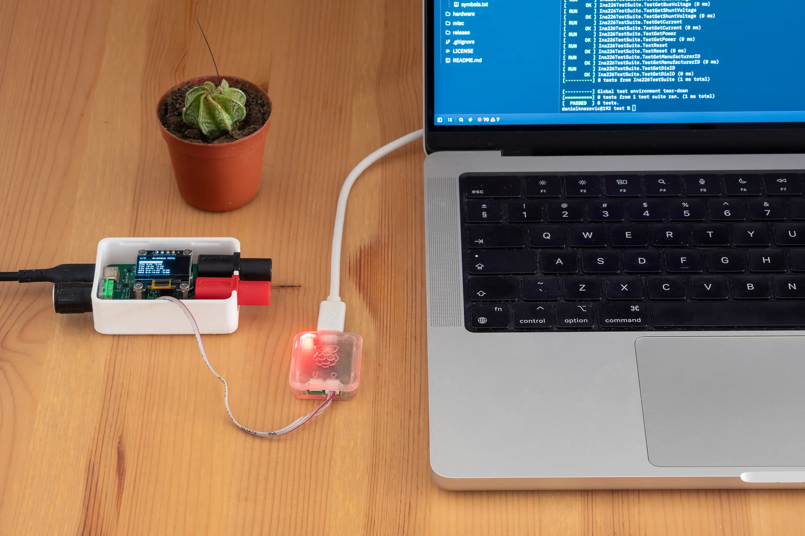

## Introduction

While the previous project log primarily described the hardware modifications with a glimpse of firmware improvements, this one focuses entirely on the software. It covers everything from utilizing modern C++ features on microcontrollers to making architectural changes that enable better testing.



This update documents the evolution of the TinyPPS firmware through three distinct phases:
1. tightening compiler constraints to eliminate hidden code risks
2. abandoning the heap to build a fully deterministic system
3. shifting the Hardware Abstraction Layer (HAL) from dynamic to static interfaces

By leveraging modern C++ features, the codebase strips away traditional runtime performance taxes while introducing a flexible framework for flashing-free host-machine testing.

## Firmware

### Compiler flags

Lets start improving the code base by enabling strict compiler warning flags. Adding `-Wall`, `-Wextra` and `-Wpedantic` significantly improves code quality, reliability and long-term maintainability.

Why these flags should be added?

- **Catch hidden bugs early:** They detect silent runtime bugs like uninitialized variables, out-of-bounds risks, or dangerous type conversions before the code ever runs.
- **Enforce strict portability:** `-Wpedantic` strictly enforces ISO C++ standards. This ensures your code compiles seamlessly across different platformsand different compilers without relying on compiler-specific hacks.

### Tackling dynamic memory allocation

Dynamic memory allocation is a big "no, no" in a safety critical systems. In microcontrollers, it is heavily restricted or banned because limited RAM, memory fragmentation, and non-deterministic execution times can crash safety-critical or real-time systems.

While this project doesn't have strict safety requirements, the overhead of dynamic allocation is still worth avoiding. It’s a great opportunity to dive into the topic and exercise heapless programming with lightweight modern C++ features. As a bonus, dropping the heap infrastructure drastically shrunk the final flash image size.

Modern C++ (C++17 and C++20) gives us the tools to eliminate the heap completely without sacrificing clean and reusable API designs.

Bellow is the strategy applied for TinyPPS:

#### Ditching `std::vector` for `std::array` + `std::span`

A `std::vector` resizes itself at runtime, triggering heap allocations that fragment SRAM. Instead, allocate fixed-size memory on the stack using `std::array`.

To keep functions reusable for arrays of different sizes, pair `std::array` with `std::span` (C++20). A span is a lightweight, non-owning view over a contiguous block of memory.

Example - before

```cpp
#include <iostream>
#include <vector>

void printSize(const std::vector<int>& vec) {
    std::cout<<"Size = " << vec.size() << "\n";
}

int main() {
    std::vector<int> some_data = {1, 2, 3};
    printSize(some_data);
}
```

Example - after

```cpp
#include <array>
#include <iostream>
#include <span>

void printSize(std::span<const int> view) {
    std::cout<<"Size = " << view.size() << "\n";
}

int main() {
    std::array<int, 3> some_data = {1, 2, 3};
    printSize(some_data);
}
```

#### Swapping `std::string` with `std::array<char, N>` + `std::string_view`

Modifying `std::string` objects (like appending text for a log entry) causes frequent, unpredictable reallocations.

The embedded fix is twofold: store raw string data in a fixed-size `std::array<char, N>` and pass strings around using `std::string_view` (C++17). Like `std::span`, a `std::string_view` is just a pointer and a length under the hood, resulting in zero allocations and zero overhead.

Example - before

```cpp
#include <iostream>
#include <string>

void printSize(const std::string& string) {
    std::cout<<"Size = " << string.size() << "\n";
}

int main() {
    std::string some_string = "Hello World!";
    printSize(some_string);
}
```

Example - after

```cpp
#include <array>
#include <iostream>
#include <string_view>

void printSize(std::string_view view) {
    std::cout << "Size = " << view.size() << "\n";
}

int main() {
    // Explicit size (12 characters + 1 null terminator = 13)
    std::array<char, 13> some_string {"Hello World!"};

    printSize(some_string.data()); 
}
```

If the string text never changes at runtime, there is no need to use `std::array`. Instead, use `static constexpr std::string_view`. This bakes the string directly into flash memory, resulting in zero RAM consumption.

### Hardware Abstraction Layer

What was wrong with the architecture of HAL that needed to be refactored? Basically nothing. It provided a great foundation for unit and mock testing via interfaces. The only exception was that the majority of HAL modules weren't actually utilizing this dynamic polymorphism at runtime.

To address this, I refactored the HAL to leverage both static and dynamic polymorphism.

Using each exactly where it makes sense:
- Static polymorphism: gpio, i2c and timer
- Dynamic polymorphism: pdsink

To implement compile-time static polymorphism, I skipped CRTP (Curiously Recurring Template Pattern) entirely. Instead, I combined C++20 Concepts with `static_assert` to build a clean, inheritance-free testing boundary. Below are code snippets demonstrating this approach.

The definition of the I2c concept:

```cpp
#ifndef i2c_hpp
#define i2c_hpp

#include <concepts>
#include <cstdint>
#include <span>

namespace hal::i2c {
/**
 * @brief Concept I2c data type.
 *
 * @tparam T The type to check.
 *
 * @note This concept requires the type to have `writeTo` and `readFrom` member
 * functions.
 */
template <typename T>
concept I2c =
    requires(const T i2c, uint8_t addr, std::span<const uint8_t> tx_data,
             std::span<uint8_t> rx_data) {
        { i2c.writeTo(addr, tx_data) } -> std::same_as<int>;
        { i2c.readFrom(addr, rx_data) } -> std::same_as<int>;
    };

}   // namespace hal::i2c

#endif   // i2c_hpp
```

Example of a concrete HAL module:

```cpp
#ifndef pico_i2c_hpp
#define pico_i2c_hpp

#include <cstdint>

#include "hardware/i2c.h"
#include "i2c.hpp"

class PicoI2c {
  public:
    /**
     * @brief Create RP2040 I2C object instance
     *
     * @param[in] i2c I2C channel. RP2040 supports i2c0 and i2c1
     */
    constexpr PicoI2c(i2c_inst_t* i2c) : m_i2c(i2c) {}

    /**
     * @brief Initialize the module
     *
     * @param[in] sda_pin GPIO pin for SDA
     * @param[in] scl_pin GPIO pin for SCL
     * @param[in] baudrate I2C baudrate in kHz
     */
    auto initialize(unsigned int sda_pin, unsigned int scl_pin,
                    unsigned int baudrate) const -> void;

    /**
     *  @brief Attempt to write specified number of bytes to address
     *
     * @param addr 7-bit address of device to write to
     * @param data A constant view of the data buffer to be sent
     * @return Number of bytes written, or error
     */
    auto writeTo(uint8_t addr, std::span<const uint8_t> tx_data) const -> int;

    /**
     * @brief Attempt to read specified number of bytes from address
     *
     * @param addr 7-bit address of device to read from
     * @param data A mutable view of the destination buffer where data will be
     * stored.
     * @return Number of bytes read, or error
     */
    auto readFrom(uint8_t addr, std::span<uint8_t> rx_data) const -> int;

  private:
    i2c_inst_t* m_i2c{nullptr};
};

static_assert(hal::i2c::I2c<PicoI2c>,
              "PicoI2c must implement hal::i2c::I2c concept!");

#endif   // pico_i2c_hpp
```

The `static_assert` at the bottom ensures that the concept is fully satisfied before compilation proceeds. It acts as an intentional gatekeeper, providing a human-readable error message that tells you exactly which requirement is missing.

Finally, to hide underlying hardware details from user modules a type alias is created inside `hardware_config.hpp`:

```cpp
using I2c = PicoI2c; 
```

By using type aliases, the business logic can simply interact with HAL classes. Switching the target microcontroller or swapping a hardware driver for a mock during unit testing requires changing only a single alias line in the configuration header. The rest of the application code remains completely untouched and perfectly uncoupled.

## Testing

TinyPPS began as a simple "can I actually build this?" hardware experiment. Initially, my main focus was on honing my skills in electronics and circuit design. As the hardware matured, the focus shifted toward hardening the firmware. Now, it's time to add tests to TinyPPS.

To setup unit tests, a `test/` folder is created with a dedicated `CMakeLists.txt` file. This way the test framework is decoupled from the actual production firmware, creating a testing sandbox. Within this sandbox Google's GoogleTest (gtest) framework is used as test engine. 


To replicate hardware behavior without a physical board, a dedicated `hardware_config.hpp` file provides the mocks and compile-time type aliases needed to enable host side testing.

Example of `hardware_config.hpp` with i2c mock and alias:

```cpp
#ifndef hardware_config_hpp
#define hardware_config_hpp

#include <gmock/gmock.h>

#include <cstdint>
#include <span>

#include "i2c.hpp"

class MockI2c {
  public:
    MOCK_METHOD(int, writeTo, (uint8_t addr, std::span<const uint8_t> tx_data),
                (const));
    MOCK_METHOD(int, readFrom, (uint8_t addr, std::span<uint8_t> rx_data),
                (const));
};

static_assert(hal::i2c::I2c<MockI2c>,
              "MockI2c does not satisfy the I2c concept!");

using I2c = MockI2c;

#endif   // hardware_config_hpp

```

This way, unit tests are able to poke modules via HAL. With no chip flashing required, it is now possible to verify both hardware peripheral modules (like Ina226, RotaryEncoder and others) and core business logic (like StateMachine) on the host machine.

At the end, it is still needed to verify everything works on hardware, but unit testing on host machine drastically reduces the time spent flashing the MCU and debugging hardware. Instead of chasing software regressions on a physical board, engineering effort can be focused strictly on validating actual hardware quirks and physical timing issues.
